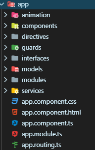
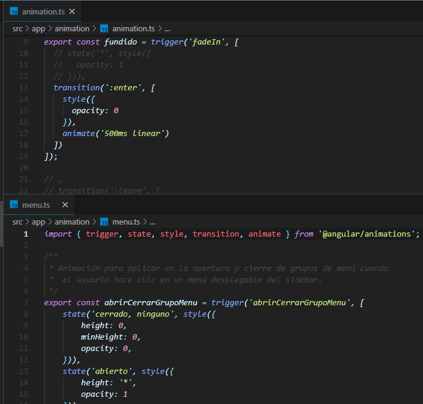
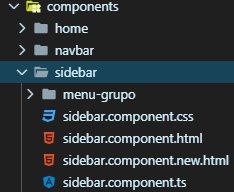
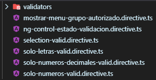
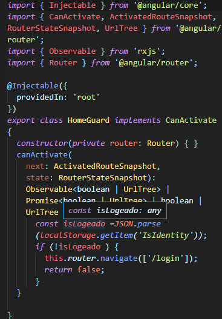
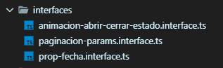
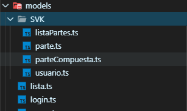
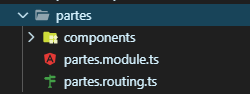
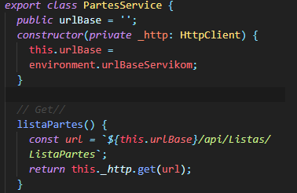

<!-- TOC -->autoauto- [SERVIKOM <!-- omit in toc -->](#servikom----omit-in-toc---)auto    - [SRC ( Principal )](#src--principal-)auto        - [APP](#app)auto        - [ANIMATIONS](#animations)auto        - [COMPONENTS](#components)auto        - [DIRECTIVES](#directives)auto        - [GUARDS](#guards)auto        - [INTERFACES](#interfaces)auto        - [MODELS](#models)autoauto<!-- /TOC -->


## NODE MODULES 

Estos archivos son las dependencias que mantenemos vía npm. Por tanto, todas las librerías que se declaren como dependencias en el archivo package.json deben estar descargados en esta carpeta node_modules. está colgando de la raíz porque vale tanto para las pruebas, como para la aplicación cuando la estás desarrollando

## SRC ( Principal )
### APP



### ANIMATIONS

- Esta capeta contiene dos archivos .ts :
  >En el [ animation.ts ] se especifica la animación de fundido y transiciones.

   >En el [ menu.ts ] se especifica la animación  transiciones de el sidebar y navbar .

 -


### COMPONENTS

- Esta carpeta contiene los  modulos principales en este caso se pueden llamar componentes o paginas; estos hacen partye de  un modulo principal por lo tanto la unica pantalla que puede tener un cambio es el home , el cual maneja  ``<router-outlet>`` o contenedor  dinamico.
  >estos componentes no cambian de estado unicamente cambia el contenido de el sidebar el cual  conecta cada modulo principal atraves de un router link

-


### DIRECTIVES

 - las directivas constan de  una carpeta *validators* esta contiene:
   - validaciones basicas 
   - manejo de controles de actualizacion 
   - selecciones unicas ( Alfanumericas ).

-
- Por medio de estas directivas se pueden manejan  controles de verificación en campos de un formulario, o en casos comunes validar   si un dato enviado corresponde al mismo asignado 


### GUARDS 

- Los guards son guardias de ruta  que permiten el control de accesos no deseados ,  son interfaces que le dicen al enrutador si debe o no  permitir una navegación hacia una ruta solicitada. 

 ;

### INTERFACES

- La carpeta interface contiene:
   

- el primero  se encarga  animacion de  abrir y cerrar

- paginacion params permite conectarn parametros de paginación
- el siguiente  es un parametro de fecha que permite validar un formato necesario


### MODELS

 

- Los modelos se crean para asociar  una respuesta de un servicio ; es decir el modelo recibe los parametros especificos tanto como para enviar o recibir datos
 ``` 
 export class ListaPartes {
  public cantidad: number;
  public id: number;
  public componenteHijo: string;

  constructor() {}
}
```
- un modelo se constituye de  la clase  con su nombre asociado ,este  se debe exportar  para que pueda ser  manejado en cualquier componente consta de un modelo asociado a cada valor se le debe asociar  un tipo de dato dependiendo del valor que se le asigne  desde el servicio, por ultimo debe contener un constructor este permite inicializar cada valor en caso de que se requiera

### MODULES

 

- Un modulo es un contenedor que permite agrupar un dominio de una aplicacion , consta de un  flujo de trabajo o  un conjunto relativamente  cercano de funcionalidades, 
 

- Para crear un Modulo  se toma  base  en angular cli  se utiliza:
```
ng generate c Nombre_Servicio 
```


### SERVICES

- Los servicios son proovedores de datos  que permiten mantener  la logica ; los servicios son consumidos por los componentes, de esta manera se puede acceder a informacion editar,eliminar  




- Para crear un servicio   se toma  base  en angular cli  se utiliza:
```
ng generate service Nombre_Servicio 
```

 - Agregar la declaracion de  un modulo para este caso se debe usar  un servicio manualmente  se utiliza el decorador 
(@NgModule) 

```
@NgModule({
  imports: [
    CommonModule
  ],
  declarations: [ListadoClientesComponent],
  providers: [ClientesService]
})
```

- En  el constructor se debe inyectar  el servicio que se vaya  usar , de esta manera se inicializa

```
export class ListadoClientesComponent {
  constructor(public clientesService: ClientesService) { }
}
```
### ASSETS


- La carpeta assets  es donde se debe guardar o copiar los archivos que se quieren utilizar en el proyecto en este caso  se usan dos carpetas 
  - img
   - Logo

