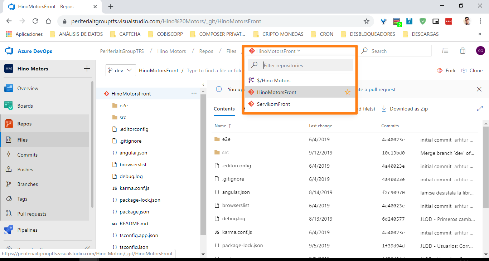
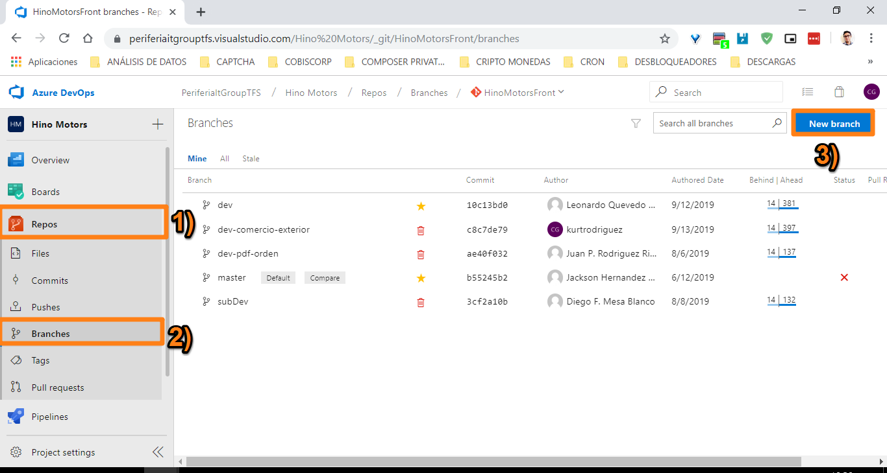
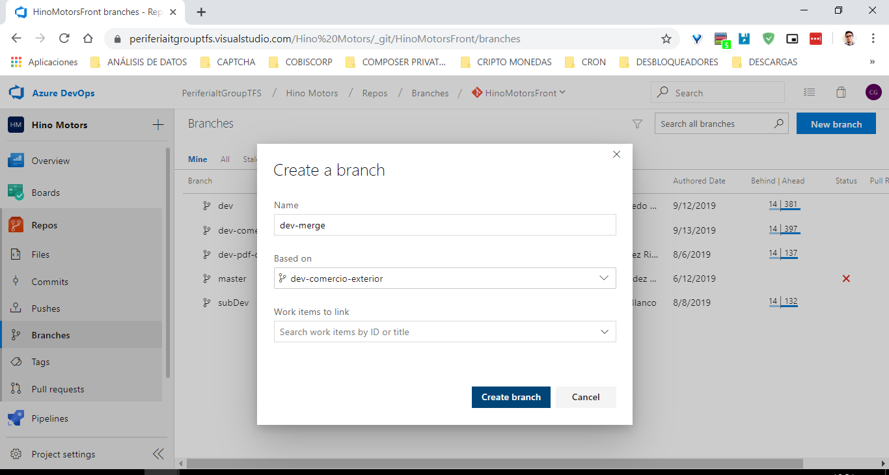

# ADMINISTRACIÓN DE UN REPOSITORIO GIT <!-- omit in toc -->

- [RAMAS (BRANCHES)](#ramas-branches)
  - [Selección del repositorio remoto desde TFS](#selecci%c3%b3n-del-repositorio-remoto-desde-tfs)
  - [Crear una rama](#crear-una-rama)
    - [Crear una rama remota desde TFS](#crear-una-rama-remota-desde-tfs)
    - [Crear una rama local y enviarla al repositorio remoto](#crear-una-rama-local-y-enviarla-al-repositorio-remoto)
  - [Actualizar el repositorio local con la nueva rama](#actualizar-el-repositorio-local-con-la-nueva-rama)
- [TAGS (VERSIONAMIENTO SEMÁNTICO)](#tags-versionamiento-sem%c3%81ntico)
  - [Eliminar un tag](#eliminar-un-tag)
    - [Eliminar un tag en el repositorio local](#eliminar-un-tag-en-el-repositorio-local)
    - [Eliminar un tag en el repositorio remoto](#eliminar-un-tag-en-el-repositorio-remoto)

## RAMAS (BRANCHES)

### Selección del repositorio remoto desde TFS
  
Desde la página del repositorio remoto en TFS, haga clic en la lista de selección en la barra de navegación junto al enlace **Files**:



A continuación, haga clic en el nombre de la rama a la que desea cambiarse.

### Crear una rama

#### Crear una rama remota desde TFS

Desde el panel izquierdo haga clic en **Repos > Branches** para ingresar a la página de administración de ramas.  A continuación, haga clic en el botón **New branch** de la esquina superior derecha para crear una rama:



Se muestra la ventana **Create a branch**.  Diligencie los campos del formulario de la siguiente manera:



- **Name:** Ingrese aquí el nombre de la nueva rama.
- **Based on:** Seleccione aquí la rama padre o raíz sobre la que se creará la rama nueva.
- **Work item to link (opcional):** Seleccione aquí los elementos de TFS a los que asociar la rama nueva (tareas, features, bugs, etc.).

Finalmente, para confirmar la creación de la rama, haga clic en el botón **Create branch.**  Para cancelar la operación en curso, haga clic en el botón **Cancelar.**

#### Crear una rama local y enviarla al repositorio remoto

Ejecute el siguiente comando desde una terminal para crear una rama en el repositorio local:

``` shell
git branch <nombre_nueva_rama>
```

O si desea cambiar la rama actual a la nueva inmediatamente después de crearla:

``` shell
git checkout -b <nombre_nueva_rama>
```

Para confirmar que la operación se realizó con éxito, ejecute el comando:

``` shell
git branch
```

Debería obtener una salida similar a la siguiente y ver el nombre de la nueva rama en la lista de ramas locales:

``` shell
user@host MINGW64 ~/Code/HinoMotorsFront (dev)
$ git branch dev-merge

user@host MINGW64 ~/Code/HinoMotorsFront (dev)
$ git branch
* dev
  dev-comercio-exterior
  dev-merge
  master
  qa
  dev-merge  # Rama nueva
```

Para enviar la rama al repositorio remoto, ejecute el siguiente comando en la terminal:

``` shell
git push origin <nombre_nueva_rama>
```

### Actualizar el repositorio local con la nueva rama

Para cambiar la rama actual a la nueva, ejecute una actualización del repositorio local:

``` shell
user@host MINGW64 ~/Code/HinoMotorsFront (dev)
$ git pull
From https://periferiaitgrouptfs.visualstudio.com/Hino%20Motors/_git/HinoMotorsFront
 * [new branch]      dev-merge  -> origin/dev-merge
Already up to date.
```

La salida indicará que existe una nueva rama a la cual se puede cambiar, ejecutando lo siguiente:

``` shell
user@host MINGW64 ~/Desktop/HinoMotorsFront (dev)
$ git checkout dev-merge
Switched to a new branch 'dev-merge'
Branch 'dev-merge' set up to track remote branch 'dev-merge' from 'origin'.
```

Ahora el repositorio se encuentra actualmente en la rama `dev-merge`.

## TAGS (VERSIONAMIENTO SEMÁNTICO)

### Eliminar un tag

#### Eliminar un tag en el repositorio local

Ejecute el siguiente comando desde una terminal para eliminar un tag del repositorio local:

``` shell
git tag -d <identificador_o_nombre_del_tag>
```

Debería obtener una salida similar a la siguiente:

``` shell
user@host MINGW64 ~/Code/HinoMotorsFront (dev)
$ git tag -d v0.0.2
Deleted tag 'v0.0.2' (was 88e4fa4)
```

#### Eliminar un tag en el repositorio remoto

Ejecute el siguiente comando desde una terminal para eliminar un tag del repositorio remoto:

``` shell
git push --delete origin <identificador_o_nombre_del_tag>
```

Debería obtener un salida similar a la siguiente:

``` shell
user@host MINGW64 ~/Code/HinoMotorsFront (dev)
$ git push --delete origin v0.0.2
To https://periferiaitgrouptfs.visualstudio.com/Hino%20Motors/_git/HinoMotorsFront
 - [deleted]         v0.0.2
```
