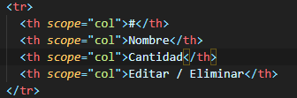
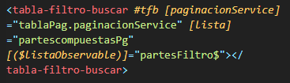
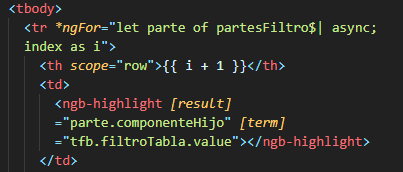
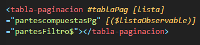
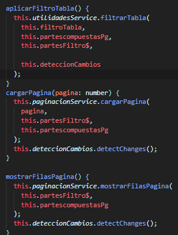

# TABLAS NG-BOOTSTRAP <!-- omit in toc -->

## ESTRUCTURA DE LA TABLE

### ETIQUETA `<TABLE>`

Se usa la etiqueta table con las clases por defecto para darle estilo a la tabla.

### ENCABEZADO DE LA TABLA

Se usa la etiqueta `<thead>` para definir los encabezados principales de la tabla.

### FILTRO

se usa  la etiqueta ``<tabla-filtro-buscar>``  del  modulo de tablas.
los parametros que se solicitan ( paginacionService ) , este solicita  la activacion de la paginacion atravez del servicio  el cual actualiza los datos en la tabla  por medio de un observable ;este debe
obtener la respuesta de un modelo que se  le asigna desde el ts.

### CUERPO DE LA TABLA

Se usa la etiqueda `<tbody>` para uso de la directiva *ngFor para recorrer el objeto y traer los datos a la tabla por columna.

#### USO DE MODALES O FUNCIONES

Se puede hacer uso de funciones o modales incrustando un boton en una columna.

### PAGINACION

 se usa  un  nuevo modulo de tablasy se activa con la etiqueta ``<tabla-paginacion>`` de la misma forma  requiere dos parametros uno es el observable ``<[($listaObservable)]="Nombre_observable$">``  y el otro indica  el modelo para poder actualizar la paginacion.
_

### METODOS 
se usan estos metodos para darle funcionalidad  a la busqueda y parametros de filtros **deteccionCambios**  se importa uy se inyecta en el contructor este permite detectar cualquier cambio que  se genere en la busqueda y el la paginacion.

