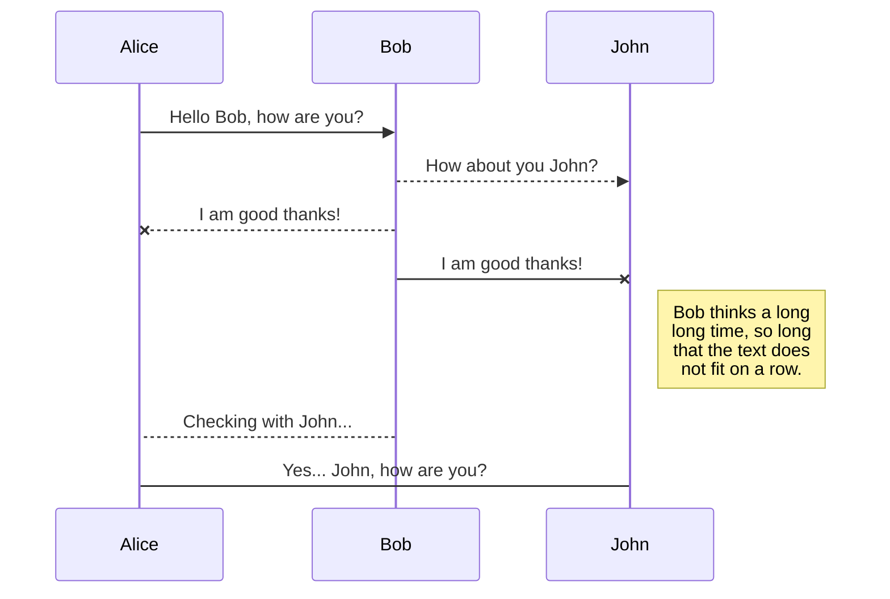
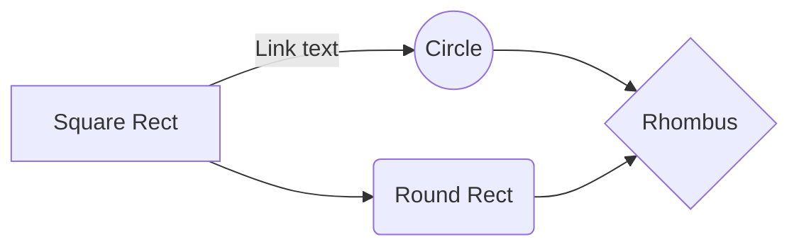

# Documentacion 
Descarga  de  proyecto desde el repositorio
>- git clone "url del proyecto"

Instalación de dependencias
>- npm install.

Inicializar aplicación 
>- ng serve -o  

## Comandos 
 Generar componente
> - Ng generate component nombreComponente ( Ng g c nombre componente )

Generar Servicio

>- ng generate service nombreServicio

Generar interface
> - ng generate  interface  nombreInterface

Generar modelo 

>- ng generate class nombreModelo

Generar directive
>- ng generate directive nombreDirectiva 

## Inyección de servicios rest 
- Obtener redireccionamiento de servicios desde el backend con url
> this.urlBase = environment.urlBaseServicio; 'http://172.17.5.51:6781';
- Declaracion de metodo en el servicio  , ejemplo :
obtenerLista() {
const  url = `${this.urlBase}/homologacion/opciones`;
return  this.http.get(url);

}

	 

## Environment

Este es nuestro archivo que entorno  global el cual permite conectar  e inyectar ciertas configuraciones con el backend;por medio de este se puede 
suministrar el re direccionamiento de servicios rest configuraciones de url para realizar un despliegue  de producción.

## UML diagrams

You can render UML diagrams using [Mermaid](https://mermaidjs.github.io/). For example, this will produce a sequence diagram:

And this will produce a flow chart:

